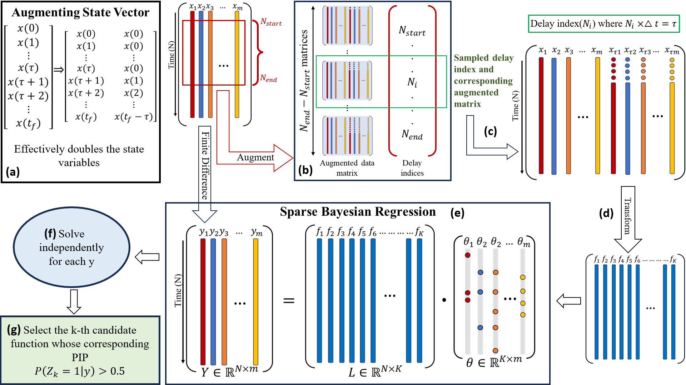

# BayTiDe - **Ba**yesian Approach for discovering **Ti**me **De**layed Differential Equations
 This repository contains the python codes for the paper
 > + Arxiv version- "A Bayesian Approach for Discovering Time Delayed Differential Equations from data." It can be accessed [here](https://arxiv.org/abs/2501.02934).


 ## General Methodology of BayTiDe
 

 ## Essential Python Libraries
 The following python packages must be installed to run the codes:
 + NumPy
 + SciPy
 + scikit-learn
 + PySINDy

 ## Datasets
 The datasets for each numerical example in the paper are available in [this](https://drive.google.com/drive/folders/18Xc7R6rcHbFmhH5mON04Y_6jh6usoeJd?usp=sharing) drive.

 ## BibTex
 If you use any part of the code, please cite us at:
 ```
 @misc{chowdhury2025bayesianapproachdiscoveringtime,
      title={A Bayesian Approach for Discovering Time- Delayed Differential Equation from Data}, 
      author={Debangshu Chowdhury and Souvik Chakraborty},
      year={2025},
      eprint={2501.02934},
      archivePrefix={arXiv},
      primaryClass={stat.ML},
      url={https://arxiv.org/abs/2501.02934}, 
}

 ```